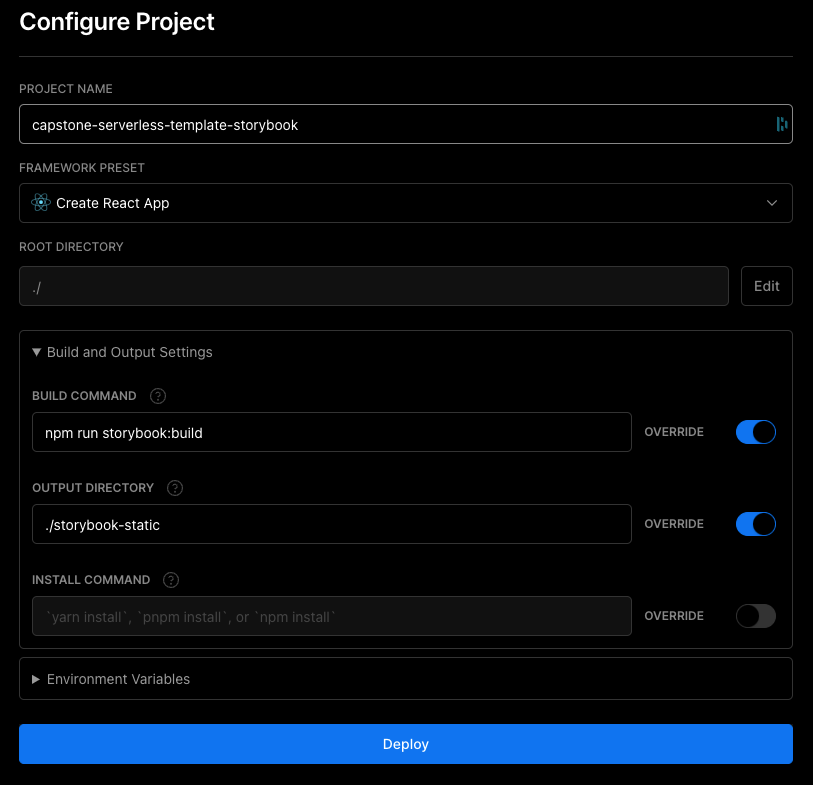

# React App

This is a template for a [Create React App](https://create-react-app.dev/) with additional tools.

<!-- toc -->

-   [Tech-Stack](#tech-stack)
-   [Project Setup](#project-setup)
    -   [Set up Vercel](#set-up-vercel)
        -   [App](#app)
        -   [Storybook](#storybook)
-   [Getting started](#getting-started)
-   [Test Driven Development](#test-driven-development)
-   [Commitlint](#commitlint)
-   [Commands](#commands)

<!-- tocstop -->

It uses the following tools/libraries:

## Tech-Stack

-   [Storybook](https://storybook.js.org/)
-   [Jest](https://jestjs.io/)
-   [Testing Library](https://testing-library.com/)
-   [Stylelint](https://stylelint.io/)
-   [Eslint](https://eslint.org/)
-   [Prettier](https://prettier.io/)
-   [Husky](https://typicode.github.io/husky/)
-   [Zustand](https://zustand-demo.pmnd.rs/)

## Project Setup

This project uses multiple Vercel deployments to make design/code reviews easier:

-   App Production
-   App Preview
-   Storybook Production
-   Storybook Preview

### Set up Vercel

Please follow this guide: https://vercel.com/docs/concepts/git

#### App

1.Follow the default setup for Create React App.

#### Storybook

1. Adjust the "Build and Output Settings"
    - BUILD COMMAND: `npm run storybook:build`
    - OUTPUT DIRECTORY: `./storybook-static`

<p align="center"></p>

## Getting started

**Run the development server:**

```bash
npm run start
```

**Run storybook:**

```shell
npm run storybook
```

## Test Driven Development

We jest to write unit tests. Please look at the Documentation for [Jest](https://jestjs.io/)
and [testing-library](https://testing-library.com/docs/react-testing-library/intro/).

## Commands

**Run the development server:**

```bash
npm run start
```

**Build:**

```shell
npm run build
```

**Run storybook:**

```shell
npm run storybook
```

**Build storybook:**

```shell
npm run storybook:build
```

**Run unit tests:**

```shell
npm run jest
# npm run jest:watch # watch
# npm run test:unit # same as "npm run jest"
```

**Run all tests:**

```shell
npm run test
```

**Run stylelint**

```shell
npm run stylelint
```

**Run eslint**

```shell
npm run eslint
```

**Run all linters**

```shell
npm run lint
```
